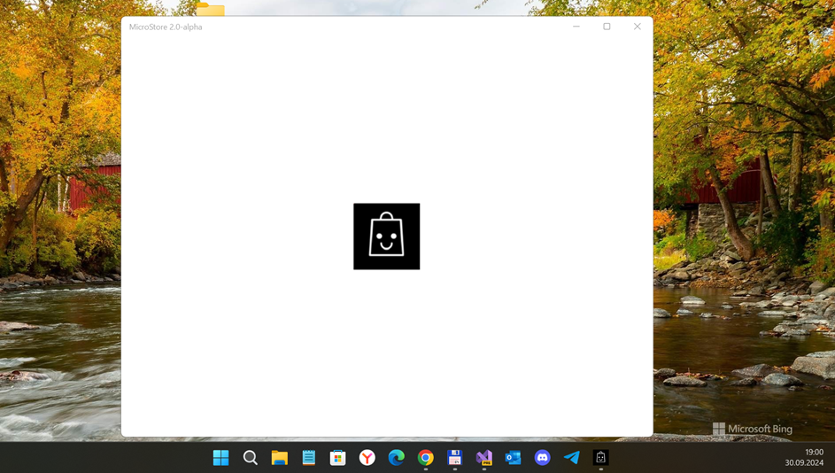
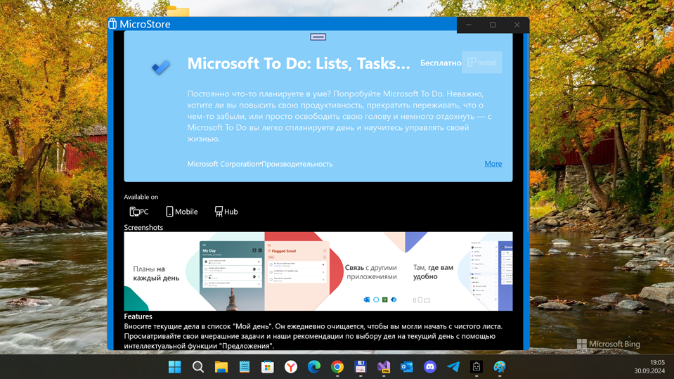
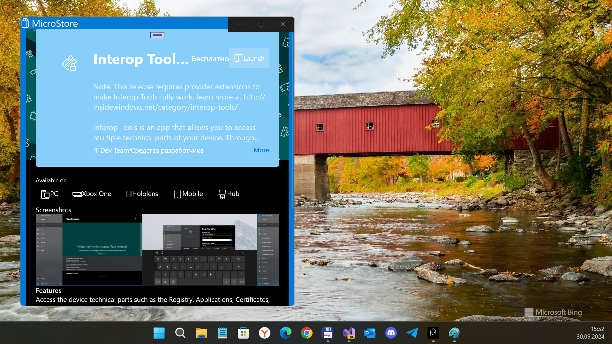
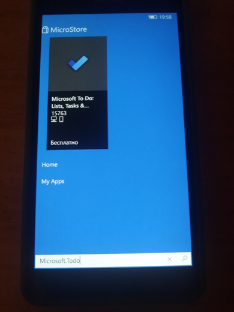
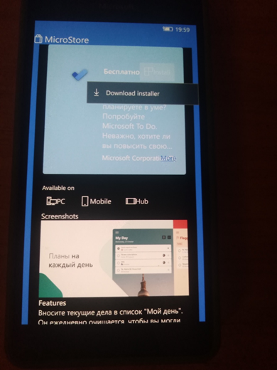
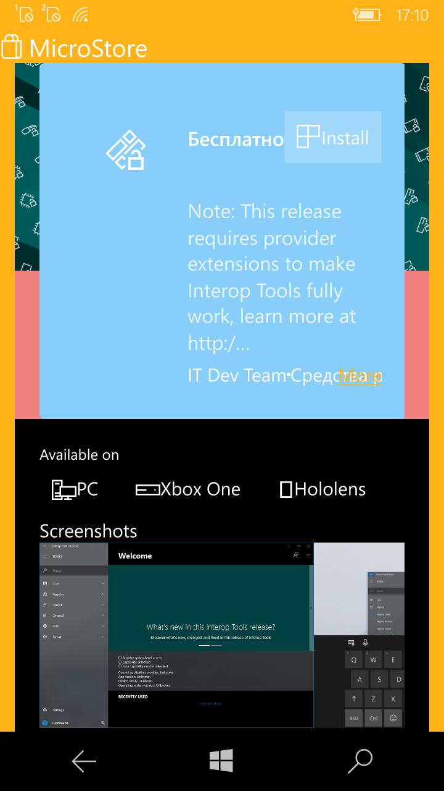
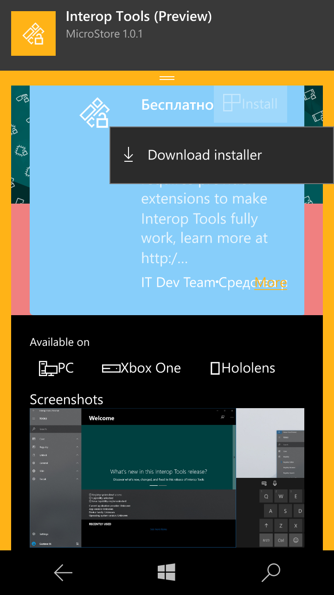

# MicroStore v2.0-alpha - andromeda branch

A UWP app for direct installing apps from MS Store

## About
MicroStore is a "Fluent Store" clone (but not fork) via porting some parts of .Net5 onto oldest base (15063). 
This project started initially as a nighits/weekend project of mine to better understand 
MS Store "System". =)

## Screenshots

## Progress
- App succesfully started under W10M on my Lumia 950 with AndromedaOS 17686 (os build = 17134)
- Experimental Download "flyout" connected to Install button :)
- Package Installer / Downloader malfunction (damaged / not realized properly, sadly!)

## Project goals
The goals for this project were simple:
- Learn the inner workings of MS Store "entity"
- Start to structure my code to match atomaric tasks as possible
- Write the code in a way that made it readable and easier to understand for someone wanting to learn as I was
- Use .Net Standard & Microsoft COmmunity Toolkit to make the app more "modular(able)" 

## Contribute!
There's still a TON of things missing from this proof-of-concept (MVP) 
and areas of improvement which I just haven't had the time to get to yet.
- Performance Improvements (async., toast...)
- Additional Package work (installer mode setting, downloader, etc.)
- Media Support: home icons, etc. (for the brave)

## Architecture of my Microstore solution
- Main project: MicroStore app (UWP, min. Win. OS build = 15063)
- Other projects are api, and MVVM/Flurl decomiled (reverse-engeneered) "system" libs

## Future plans (docs, refactoring, etc.)
Maybe, in future I 'll add some tech DOCs which explains miscellaneous functionality... =)

## Credits
- [TitleOS](https://github.com/TitleOS) - StoreLib and StoreWeb creator/author
- [StoreLib](https://github.com/StoreDev/StoreLib) - DotNet library that provides APIs to interact with the various Microsoft Store endpoints.
- [StoreWeb](https://github.com/StoreDev/StoreWeb) - An interface for StoreLib created in ASP.NET
- [FluentStore](https://github.com/yoshiask/FluentStore) - Fluent Store project
- [Microsoft](https://github.com/microsoft) - Thanx for all your open-source samples of your great code :)

## License & Copyright
Distributed under the MIT License.

##  ..
- As is. No support. RnD purpose only. DIY.

## .
- mediaexplorer 2024