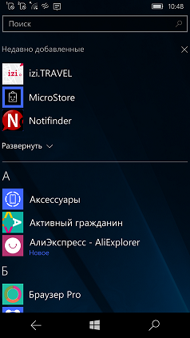

# MicroStore - a UWP app for direct installing apps from MS Store

MicroStore is a "Fluent Store" clone via porting some parts of .Net5 onto oldest base (15063). 
This project started initially as a nighits/weekend project of mine to better understand 
MS Store "System". =)

# Screenshots

The goals for this project were simple:
- Learn the inner workings of MS Store "entity"
- Start to structure my code to match atomaric tasks as possible
- Write the code in a way that made it readable and easier to understand for someone wanting to learn as I was
- Use .Net Standard & Microsoft COmmunity Toolkit to make the app more "modular(able)" 

# Contribute!
There's still a TON of things missing from this proof-of-concept (MVP) 
and areas of improvement which I just haven't had the time to get to yet.
- Performance Improvements (async., toast...)
- Additional Package work (installer mode setting, downloader, etc.)
- Media Support: home icons, etc. (for the brave)

# Architecture 

- Main project: MicroStore
- Other projects are api, MVVM/Flurl decomiled libs

Maybe, in future I 'll add some tech DOCs which explains miscellaneous functionality... =)

With best wishes,

  [m][e] 2021

# Thanks!
I wanted to put down some thank you's here for folks/projects/websites that were invaluable for helping me get this project into a functional state:
- [TitleOS](https://github.com/TitleOS) - StoreLib and StoreWeb creator/author
- [StoreLib](https://github.com/StoreDev/StoreLib) - DotNet library that provides APIs to interact with the various Microsoft Store endpoints.
- [StoreWeb](https://github.com/StoreDev/StoreWeb) - An interface for StoreLib created in ASP.NET
- [FluentStore](https://github.com/yoshiask/FluentStore) - Fluent Store project
- [Microsoft](https://github.com/microsoft) - Thanx for all your open-source samples of your great code :)

# License & Copyright

MicroStore is RnD project. AS-IS. No support. Distributed under the MIT License. 